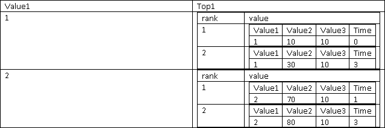

# CollectTOP (Azure Stream Analytics)
  Returns an array of ranked records, where rank defines the ranking position of the event in the window according to the specified ordering. Ordering/ranking is based on event columns and can be specified in ORDER BY clause.  
  
 ## Syntax  
  
```SQL
-- Aggregate Function Syntax
CollectTop(<number of events as integer literal>) OVER (ORDER BY (<column name> [ASC |DESC])+)

-- Analytic Function Syntax
CollectTop(<number of events as integer literal>) OVER ([<PARTITION BY clause>] ORDER BY (<column name> [ASC | DESC])+ <LIMIT DURATION clause>  [<WHEN clause>])
```
  
## Arguments  
 **\<number of events as integer literal>**  
  
 The number of top events the user wants to collect from the window.  
  
 **\<column name>**  
  
 Name of the column in the input event, by which ordering will be done. Only ordering by bigint/float/datetime types is allowed.

**OVER ([\<PARTITION BY clause> \<LIMIT DURATION clause> [\<WHEN clause>]]**

Determines the group of rows over which CollectTop is applied. The PARTITION BY clause specifies that the rows with the same partition key will be grouped together. The LIMIT DURATION clause specifies how much history is included in the group. The WHEN clause specifies a boolean condition for the rows to be included in the group. See [OVER clause](over-azure-stream-analytics.md) for more details on the usage.

## Return Types  
 Array of records of type { “rank” : bigint, “value”: record  }  
  
## Remarks  
 Null is treated as the minimal value, for more information look at [https://msdn.microsoft.com/library/ms188385.aspx](https://msdn.microsoft.com/library/ms188385.aspx)  
  
## Examples  
  
```SQL  
SELECT   
    value1,  
    CollectTop(2) OVER (ORDER BY value2 ASC, value3 DESC) as top1  
FROM testinput timestamp by time  
GROUP BY TumblingWindow(second, 5), value1  
```  
  
 Example input:  
  

  
 Example output:  



  
