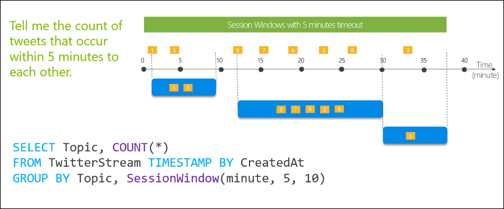

# Session window (Azure Stream Analytics)
Session windows group events that arrive at similar times, filtering out periods of time where there is no data. Session window function has three main parameters: timeout, maximum duration, and partitioning key (optional). 

The following diagram illustrates a stream with a series of events and how they are mapped into session windows of 5 minutes timeout, and maximum duration of 10 minutes.

 

A session window begins when the first event occurs. If another event occurs within the specified timeout from the last ingested event, then the window extends to include the new event. Otherwise if no events occur within the timeout, then the window is closed at the timeout.

If events keep occurring within the specified timeout, the session window will keep extending until maximum duration is reached. Please note that the maximum duration checking intervals are set to be the same size as the specified max duration. For example, if the max duration is 10, then the checks on if the window exceed maximum duration will happen at t = 0, 10, 20, 30, etc. That means that the actual duration of a session windows could then be up to twice maxDuration.

Thus mathematically, our session window ends if the following condition is satisfied:

 

When a partition key is provided, the events are grouped together by the key and session window is applied to each group independently. This is useful for cases where you need different session windows for different users or devices.

## Syntax

```SQL
{SESSIONWINDOW | SESSION} (timeunit, timeoutSize, maxDurationSize) [OVER (PARTITION BY partitionKey)]

{SESSIONWINDOW | SESSION} (Timeout(timeunit , timeoutSize), MaxDuration(timeunit, maxDurationSize)) [OVER (PARTITION BY partitionKey)]

```

> [!NOTE]
> The Session Window can be used in the above two ways.

## Arguments

**timeunit**
Is the unit of time for the windowsize. The following table lists all valid timeunit arguments.

|Timeunit|Abbreviations|
|--------------|-------------------|
|day|dd, d|
|hour|hh|
|minute|mi, n|
|second|ss, s|
|millisecond|ms|
|microsecond|mcs|

**timeoutsize**

A big integer that describes the gap size of the session window. Data that occur within the gap size are grouped together in the same window.

**maxdurationsize**

If the total window size exceeds the specified maxDurationSize at a checking point, then the window is closed and a new window is opened at the same point. Currently, the size of the checking interval is equal to maxDurationSize.

**partitionkey**

An optional parameter that specifies the key that the session window operates over. If specified, the window will only group together events of the same key.

## Examples
Suppose you have the following json data:

```JSON
[
  // time: the timestamp when the user clicks on the link
  // user_id: the id of the user
  // url: the url the user clicked on
  {
    "time": "2017-01-26T00:00:00.0000000z",
    "user_id": 0,
    "url": "www.example.com/a.html"
  },
  {
    "time": "2017-01-26T00:00:20.0000000z",
    "user_id": 0,
    "url": "www.example.com/b.html"
  },
  {
    "time": "2017-01-26T00:00:55.0000000z",
    "user_id": 1,
    "url": "www.example.com/c.html"
  },
  // ...
]
```

To measure how long each user sessions are, you can use the following query:

```SQL
CREATE TABLE localinput(time DATETIME, user_id BIGINT, url NVARCHAR(MAX))
SELECT
    user_id,
    MIN(time) AS window_start,
    System.Timestamp() AS window_end,
    DATEDIFF(s, MIN(time), System.Timestamp()) AS duration_in_seconds
FROM localinput TIMESTAMP BY time
GROUP BY user_id, SessionWindow(minute, 2, 60) OVER (PARTITION BY user_id)
```

The preceding query creates a session window with a timeout of 2 minutes, a maximum duration of 60 minutes and partitioning key of user_id. This means independent session windows will be created for each user_id. For each window, this query will generate output that contains the user_id, the start time of the window (window_start), the end of the window (window_end) and the total duration of the user session (duration_in_seconds).

