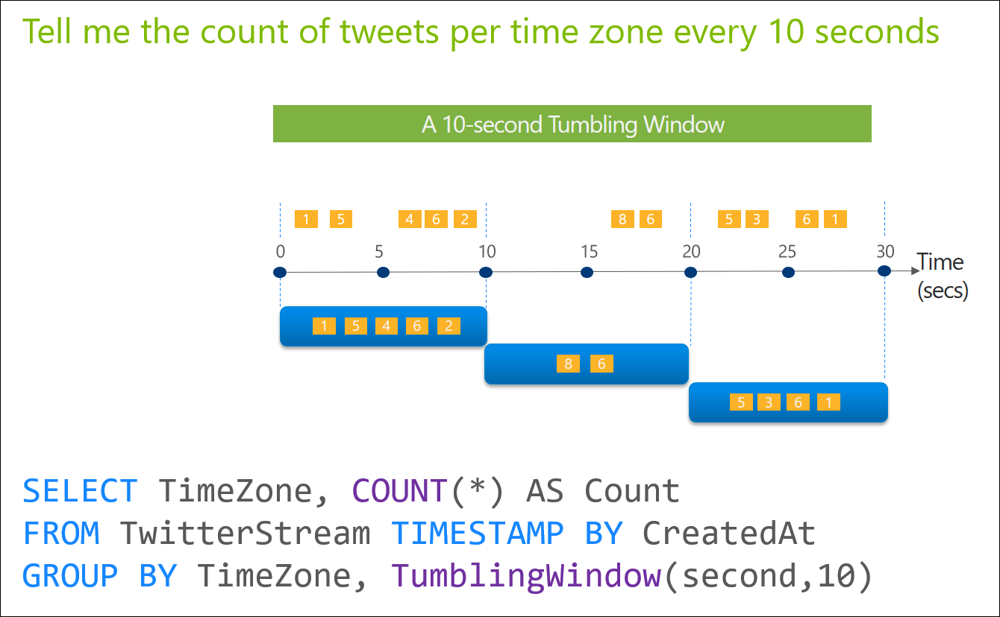

# Windowing functions (Azure Stream Analytics)

In applications that process real-time events, it is common to perform some set-based computation (aggregation) or other operations over subsets of events that fall within some period of time. Because the concept of time is a fundamental necessity to complex event-processing systems, it’s important to have a simple way to work with the time component of query logic in the system. In Azure Stream Analytics, these subsets of events are defined through windows to represent groupings by time. This article describes windows and how they are defined, identifies the types of windows that are supported, and explains how you can use windows with various operators.

## Understanding Windows

A window contains event data along a timeline and enables you to perform various operations against the events within that window. For example, you may want to sum the values of payload fields in a given window as shown in the following illustration.

   

**Every window operation outputs event at the end of the window**. The windows of Azure Stream Analytics are opened at the window start time and closed at the window end time. For example, if you have a 5 minute window from 12:00 AM to 12:05 AM all events with timestamp greater than 12:00 AM  and up to timestamp 12:05 AM inclusive will be included within this window. The output of the window will be a single event based on the aggregate function used with a timestamp equal to the window end time.  The timestamp of the output event of the window can be projected in the SELECT statement using the System.Timestamp() property using an alias. Every window automatically aligns itself to the zeroth hour. For example, a 5 minute tumbling window will align itself to (12:00-12:05] , (12:05-12:10], ..., and so on.

After a window operation, the timestamp of an event will differ from the original event time attribute (either the [arrival time](stream-analytics-time-handling) or the column used with [TIMESTAMP BY](timestamp-by-azure-stream-analytics)). The current, updated timestamp of an event can always be accessed with [system.timestamp()](system-timestamp-stream-analytics).

> [!NOTE]
> All windows should be used in a GROUP BY clause.

There are five types of windows:

1. [Tumbling Window &#40;Azure Stream Analytics&#41;](tumbling-window-azure-stream-analytics.md)

2. [Hopping Window &#40;Azure Stream Analytics&#41;](hopping-window-azure-stream-analytics.md)

3. [Sliding Window &#40;Azure Stream Analytics&#41;](sliding-window-azure-stream-analytics.md)

4. [Session Window &#40;Azure Stream Analytics&#41;](session-window-azure-stream-analytics.md)

5. [Snapshot Window (Azure Stream Analytics)](snapshot-window-azure-stream-analytics.md)

 The maximum size of the window in all cases is 7 days.

You can aggregate over multiple time windows in the same GROUP BY statement using the [Windows &#40;Azure Stream Analytics&#41;](windows-azure-stream-analytics.md) function.

## See Also  

[Built-in Functions &#40;Azure Stream Analytics&#41;](built-in-functions-azure-stream-analytics.md)   
[Aggregate Functions &#40;Azure Stream Analytics&#41;](aggregate-functions-azure-stream-analytics.md)   
[Analytic Functions &#40;Azure Stream Analytics&#41;](analytic-functions-azure-stream-analytics.md)   
[Array Functions &#40;Stream Analytics&#41;](array-functions-stream-analytics.md)   
[Conversion Functions &#40;Azure Stream Analytics&#41;](conversion-functions-azure-stream-analytics.md)   
[Date and Time Functions &#40;Azure Stream Analytics&#41;](date-and-time-functions-azure-stream-analytics.md)   
[Record Functions &#40;Azure Stream Analytics&#41;](record-functions-azure-stream-analytics.md)  
  
